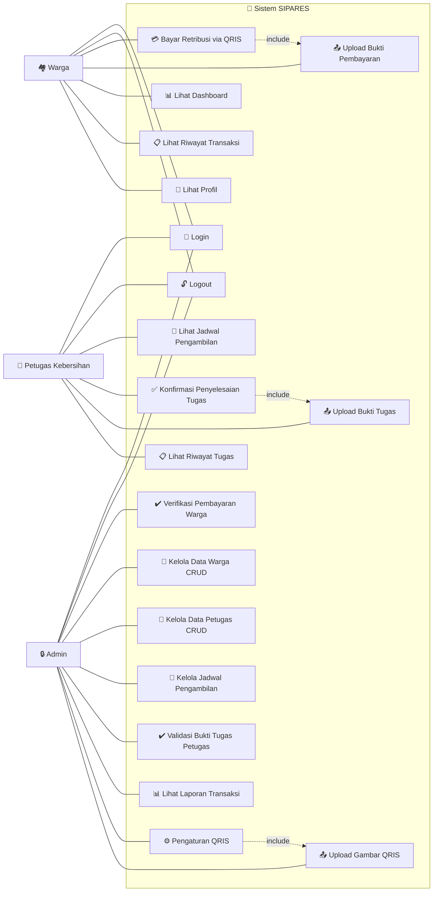

# 🎯 Use Case Diagram — SIPARES

**Sistem Pembayaran Retribusi Sampah**

---

## Diagram

---

## Deskripsi Use Case

| No | Use Case | Aktor | Deskripsi |
|----|----------|-------|-----------|
| UC1 | Login | Semua | Masuk ke sistem dengan username, password, dan role |
| UC2 | Logout | Semua | Keluar dari sistem |
| UC3 | Bayar Retribusi via QRIS | Warga | Melakukan pembayaran retribusi sampah Rp 25.000/bulan |
| UC4 | Upload Bukti Pembayaran | Warga | Mengunggah bukti pembayaran (JPG/PNG/WebP/PDF, maks 5MB) |
| UC5 | Lihat Dashboard | Warga | Melihat ringkasan pembayaran dan status bulan ini |
| UC6 | Lihat Riwayat Transaksi | Warga | Melihat seluruh riwayat pembayaran |
| UC7 | Lihat Profil | Warga | Melihat informasi profil pribadi |
| UC8 | Lihat Jadwal Pengambilan | Petugas | Melihat daftar jadwal tugas pengambilan sampah |
| UC9 | Konfirmasi Penyelesaian Tugas | Petugas | Menandai tugas sebagai selesai dan upload bukti |
| UC10 | Upload Bukti Tugas | Petugas | Mengunggah foto/PDF bukti tugas selesai (multiple file) |
| UC11 | Lihat Riwayat Tugas | Petugas | Melihat riwayat tugas yang sudah diselesaikan |
| UC12 | Verifikasi Pembayaran | Admin | Menyetujui atau menolak pembayaran warga |
| UC13 | Kelola Data Warga | Admin | CRUD data warga (tambah, edit, hapus) |
| UC14 | Kelola Data Petugas | Admin | CRUD data petugas kebersihan (tambah, edit, hapus) |
| UC15 | Kelola Jadwal Pengambilan | Admin | Membuat jadwal pengambilan sampah baru |
| UC16 | Validasi Bukti Tugas | Admin | Menyetujui/menolak laporan tugas petugas |
| UC17 | Lihat Laporan Transaksi | Admin | Melihat semua transaksi dengan filter status |
| UC18 | Pengaturan QRIS | Admin | Mengelola gambar QRIS pembayaran |
| UC19 | Upload Gambar QRIS | Admin | Mengunggah gambar QRIS baru untuk tampil ke warga |

---

## Relasi Include

| Use Case Utama | Include | Keterangan |
|----------------|---------|------------|
| UC3 — Bayar Retribusi via QRIS | UC4 — Upload Bukti Pembayaran | Pembayaran wajib menyertakan bukti transfer |
| UC9 — Konfirmasi Penyelesaian Tugas | UC10 — Upload Bukti Tugas | Konfirmasi tugas wajib disertai bukti foto/PDF |
| UC18 — Pengaturan QRIS | UC19 — Upload Gambar QRIS | Pengaturan QRIS memerlukan upload file gambar |
