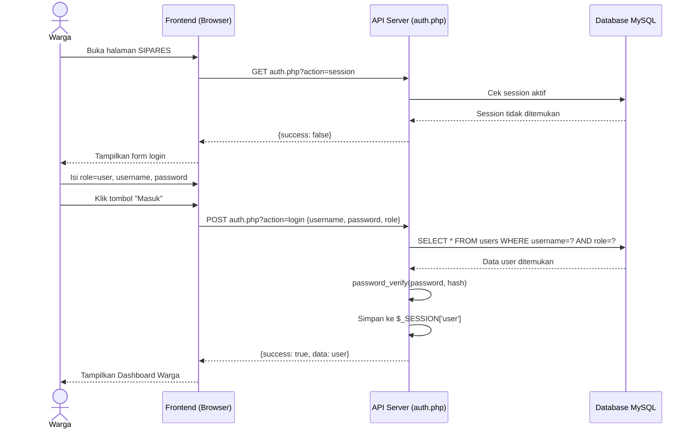
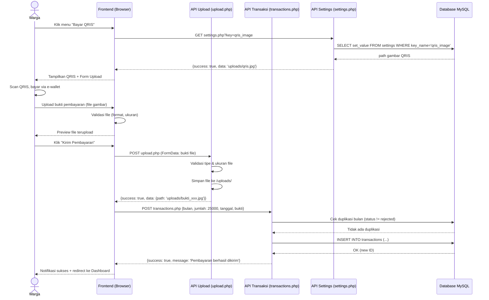
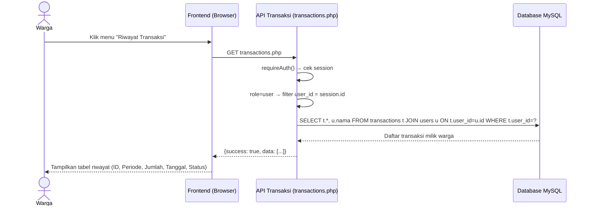
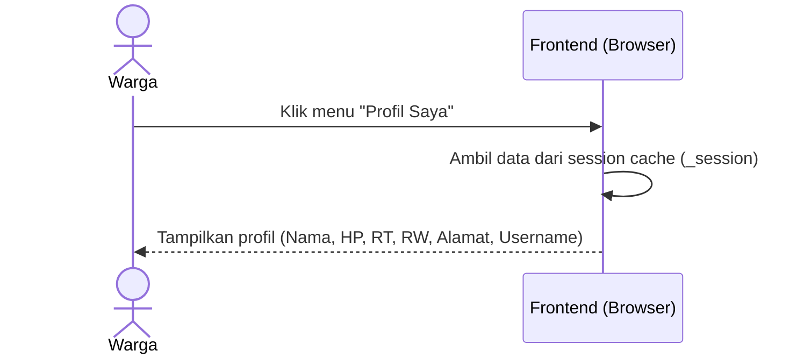

# 🔄 Sequence Diagram — Warga

**SIPARES - Sistem Pembayaran Retribusi Sampah**

---

## A. Login Warga

---

## B. Pembayaran Retribusi QRIS

---

## C. Lihat Riwayat Transaksi

---

## D. Lihat Profil

