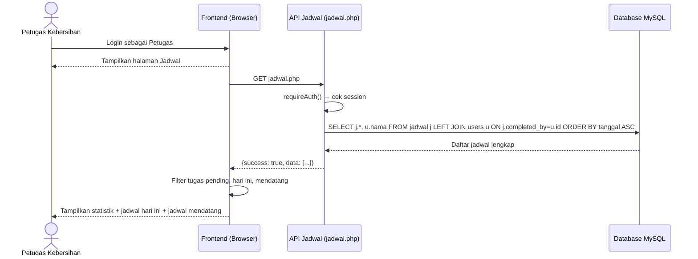
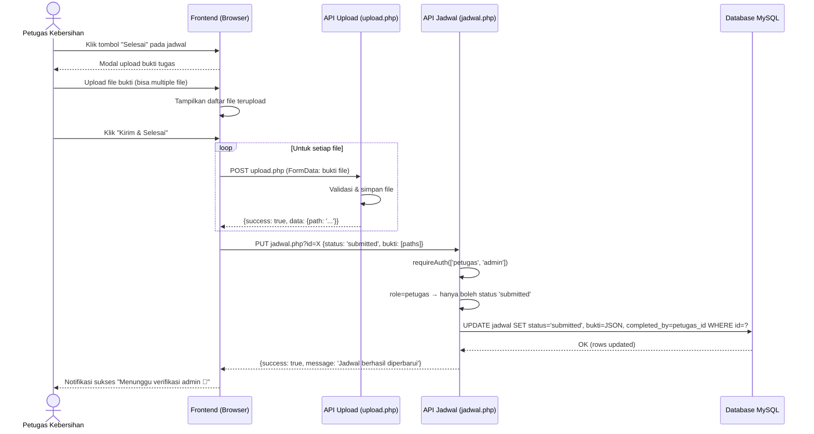
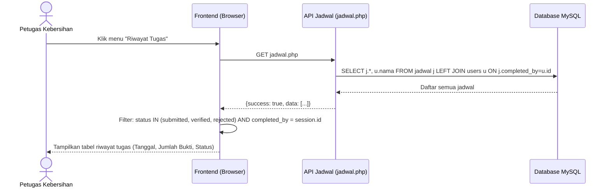

# 🔄 Sequence Diagram — Petugas Kebersihan

**SIPARES - Sistem Pembayaran Retribusi Sampah**

---

## A. Lihat Jadwal Pengambilan Sampah

---

## B. Konfirmasi Penyelesaian Tugas (Submit Bukti)

---

## C. Lihat Riwayat Tugas

