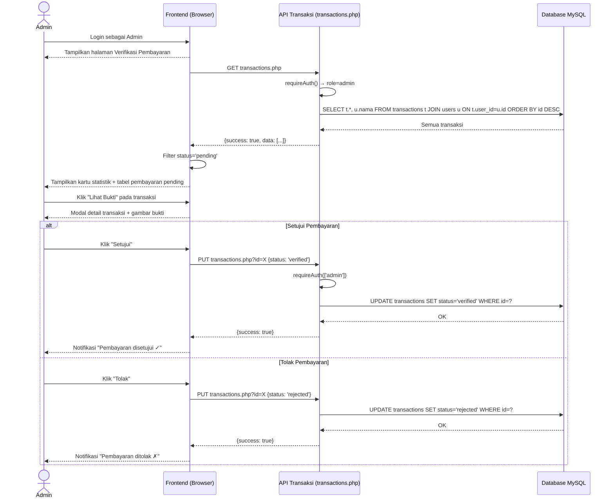
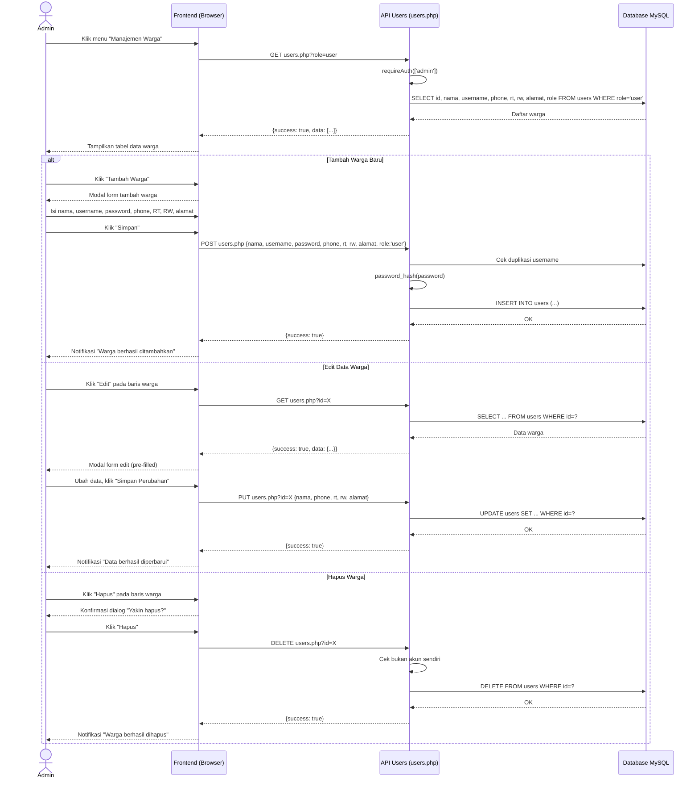
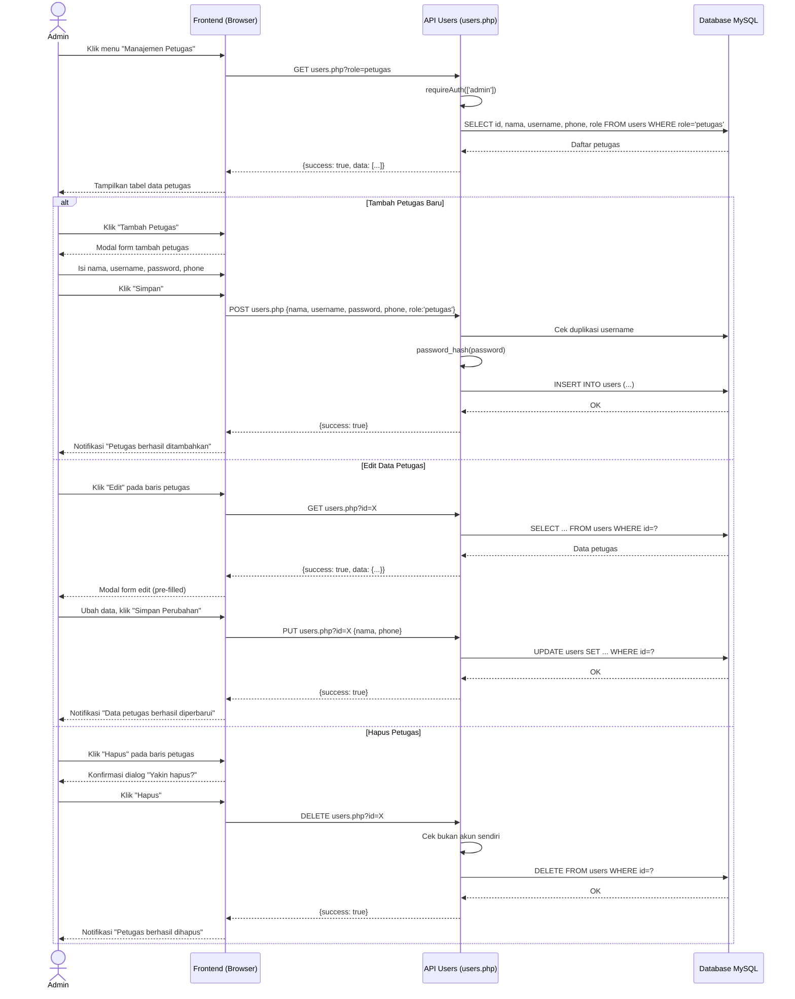
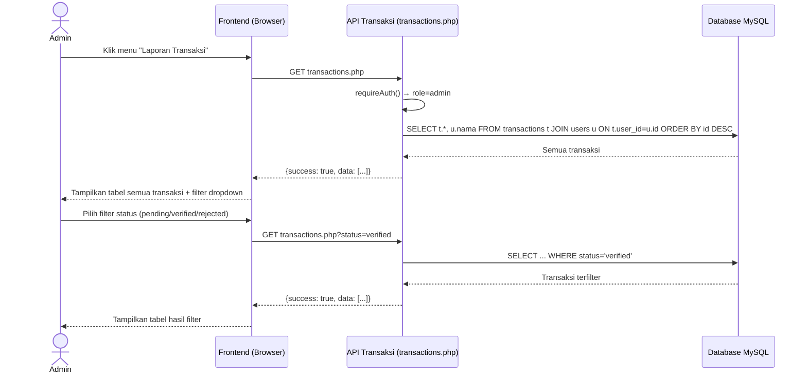
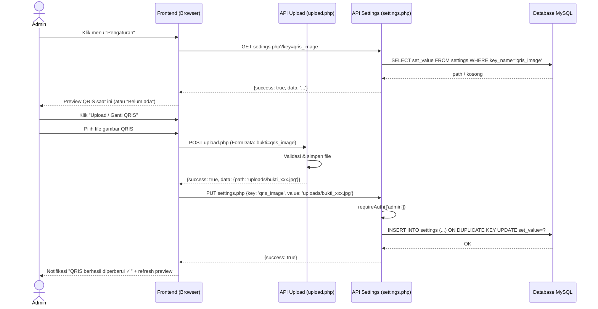

# 🔄 Sequence Diagram — Admin

**SIPARES - Sistem Pembayaran Retribusi Sampah**

---

## A. Verifikasi Pembayaran Warga

---

## B. Kelola Data Warga (CRUD)

---

## C. Kelola Data Petugas (CRUD)

---

## D. Kelola Jadwal & Validasi Tugas Petugas

```mermaid
sequenceDiagram
    actor A as Admin
    participant FE as Frontend (Browser)
    participant API as API Jadwal (jadwal.php)
    participant DB as Database MySQL

    A->>FE: Klik menu "Jadwal & Tugas"
    FE->>API: GET jadwal.php
    API->>DB: SELECT j.*, u.nama FROM jadwal j LEFT JOIN users u ON j.completed_by=u.id
    DB-->>API: Semua jadwal
    API-->>FE: {success: true, data: [...]}
    FE-->>A: Tabel tugas menunggu + semua jadwal

    alt Tambah Jadwal Baru
        A->>FE: Klik "Tambah Jadwal"
        FE-->>A: Modal form tanggal
        A->>FE: Pilih tanggal, klik "Simpan"
        FE->>API: POST jadwal.php {tanggal: '2026-04-20'}
        API->>DB: INSERT INTO jadwal (tanggal, status='pending')
        DB-->>API: OK
        API-->>FE: {success: true}
        FE-->>A: Notifikasi "Jadwal ditambahkan"
    else Validasi Bukti Tugas Petugas
        A->>FE: Klik "Validasi" pada tugas submitted
        FE-->>A: Modal bukti foto/PDF + detail
        alt Setujui Tugas
            A->>FE: Klik "Setujui"
            FE->>API: PUT jadwal.php?id=X {status: 'verified'}
            API->>DB: UPDATE jadwal SET status='verified' WHERE id=?
            DB-->>API: OK
            API-->>FE: {success: true}
            FE-->>A: "Tugas disetujui ✓"
        else Tolak Tugas
            A->>FE: Klik "Tolak"
            FE->>API: PUT jadwal.php?id=X {status: 'rejected'}
            API->>DB: UPDATE jadwal SET status='rejected' WHERE id=?
            DB-->>API: OK
            API-->>FE: {success: true}
            FE-->>A: "Tugas ditolak, petugas perlu melapor ulang"
        end
    end
```

---

## E. Laporan Transaksi

---

## F. Pengaturan QRIS

