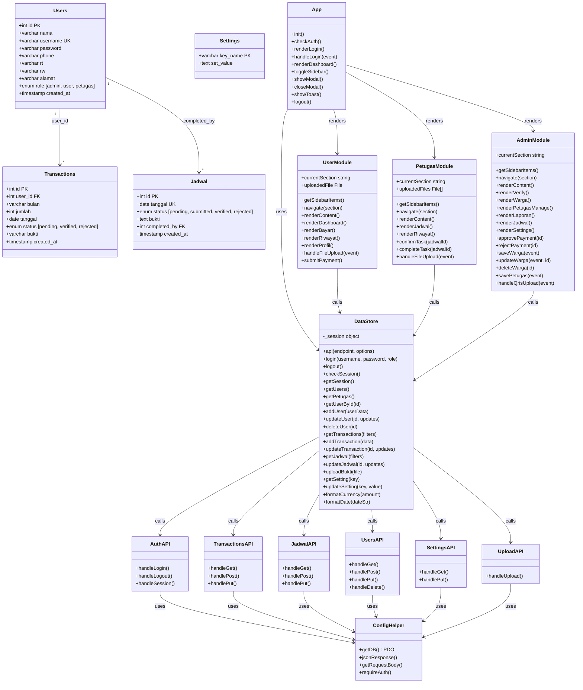

# 🏗️ Class Diagram — SIPARES

**Sistem Pembayaran Retribusi Sampah**

---

## Diagram

---

## Penjelasan Relasi

### Relasi Database (Entity)

| Relasi | Tipe | Keterangan |
|--------|------|------------|
| Users → Transactions | One-to-Many | Satu user (warga) bisa memiliki banyak transaksi. Foreign Key: `user_id` |
| Users → Jadwal | One-to-Many | Satu user (petugas) bisa menyelesaikan banyak jadwal. Foreign Key: `completed_by` |

### Relasi Backend (API Layer)

| Dari | Ke | Tipe | Keterangan |
|------|-----|------|------------|
| Semua API | ConfigHelper | Dependency | Semua API menggunakan helper untuk koneksi DB, auth, dan response |

### Relasi Frontend

| Dari | Ke | Tipe | Keterangan |
|------|-----|------|------------|
| App | DataStore | Dependency | App menggunakan DataStore untuk komunikasi API |
| App | UserModule / PetugasModule / AdminModule | Composition | App merender modul sesuai role user |
| UserModule / PetugasModule / AdminModule | DataStore | Dependency | Setiap modul memanggil DataStore untuk operasi data |
| DataStore | Semua API | Association | DataStore memanggil endpoint API via fetch() |
