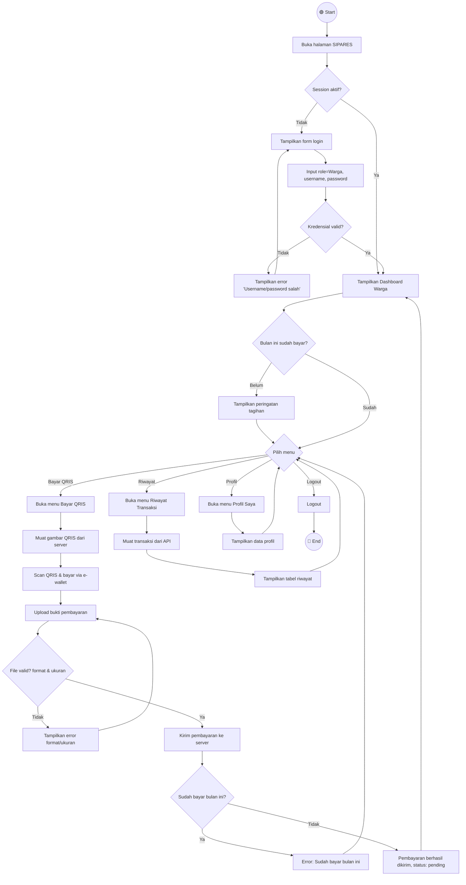

# 🚶 Activity Diagram — Warga

**SIPARES - Sistem Pembayaran Retribusi Sampah**

---

## Activity Diagram — Pembayaran Retribusi Sampah

---

## Penjelasan Alur

| No | Langkah | Keterangan |
|----|---------|------------|
| 1 | **Login** | Warga membuka halaman dan sistem mengecek apakah session masih aktif |
| 2 | **Dashboard** | Menampilkan ringkasan: total pembayaran, status bulan ini, transaksi terakhir |
| 3 | **Cek Bulan Ini** | Jika belum bayar bulan ini, tampilkan peringatan tagihan |
| 4 | **Bayar QRIS** | Muat gambar QRIS → scan & bayar → upload bukti → kirim ke server |
| 5 | **Validasi File** | Cek format (JPG/PNG/WebP/PDF) dan ukuran (maks 5MB) |
| 6 | **Cek Duplikasi** | Server memastikan belum ada pembayaran bulan ini (kecuali yang ditolak) |
| 7 | **Riwayat** | Menampilkan tabel semua transaksi warga |
| 8 | **Profil** | Menampilkan informasi nama, HP, RT/RW, alamat |
| 9 | **Logout** | Menghapus session dan kembali ke halaman login |
