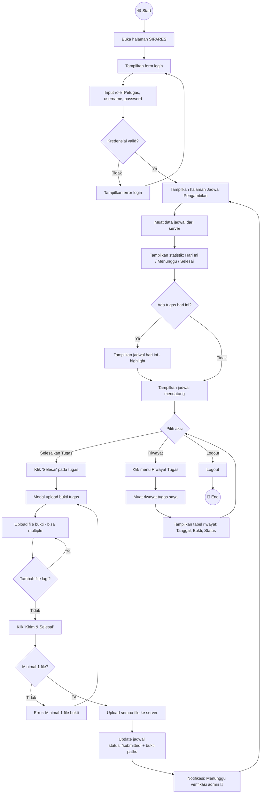

# 🚶 Activity Diagram — Petugas Kebersihan

**SIPARES - Sistem Pembayaran Retribusi Sampah**

---

## Activity Diagram — Penyelesaian Tugas Pengambilan Sampah

---

## Penjelasan Alur

| No | Langkah | Keterangan |
|----|---------|------------|
| 1 | **Login** | Petugas login dengan role=petugas, username, dan password |
| 2 | **Dashboard Jadwal** | Menampilkan statistik (tugas hari ini, menunggu, selesai) |
| 3 | **Cek Tugas Hari Ini** | Jika ada tugas hari ini, tampilkan dengan highlight biru |
| 4 | **Jadwal Mendatang** | Tampilkan jadwal yang belum dikerjakan |
| 5 | **Selesaikan Tugas** | Klik "Selesai" → muncul modal upload bukti |
| 6 | **Upload Bukti** | Petugas bisa upload multiple file (foto/PDF) sebagai bukti |
| 7 | **Validasi File** | Minimal 1 file harus diupload sebelum submit |
| 8 | **Submit Tugas** | Upload semua file → update status jadwal menjadi "submitted" |
| 9 | **Menunggu Verifikasi** | Tugas menunggu validasi dari admin |
| 10 | **Riwayat** | Lihat daftar tugas yang sudah dikerjakan beserta statusnya |
| 11 | **Logout** | Keluar dari sistem |
