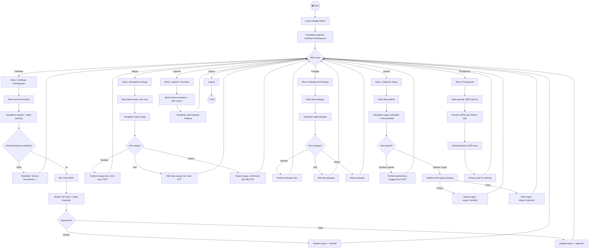

# 🚶 Activity Diagram — Admin

**SIPARES - Sistem Pembayaran Retribusi Sampah**

---

## Activity Diagram — Manajemen Sistem SIPARES

---

## Penjelasan Alur

| No | Menu | Langkah-langkah |
|----|------|-----------------|
| 1 | **Verifikasi Pembayaran** | Lihat daftar pembayaran pending → klik lihat bukti → setujui atau tolak |
| 2 | **Manajemen Warga** | Lihat tabel warga → tambah/edit/hapus data warga |
| 3 | **Manajemen Petugas** | Lihat tabel petugas → tambah/edit/hapus data petugas |
| 4 | **Jadwal & Tugas** | Tambah jadwal baru → validasi bukti tugas petugas (setujui/tolak) |
| 5 | **Laporan Transaksi** | Lihat semua transaksi → filter berdasarkan status |
| 6 | **Pengaturan** | Lihat preview QRIS saat ini → upload QRIS baru → simpan ke database |
| 7 | **Logout** | Keluar dari sistem |
