# 📐 UML - SIPARES (Sistem Pembayaran Retribusi Sampah)

Dokumentasi Unified Modeling Language (UML) lengkap untuk website **SIPARES** yang mencakup Use Case Diagram, Sequence Diagram, Class Diagram, dan Activity Diagram untuk 3 aktor: **Warga**, **Petugas Kebersihan**, dan **Admin**.

---

## 1. 🎯 Use Case Diagram

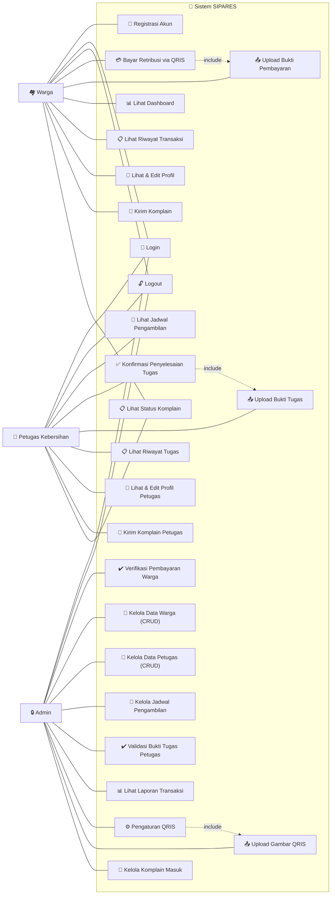
```mermaid
graph LR
    subgraph SIPARES["🏢 Sistem SIPARES"]
        UC1["🔐 Login"]
        UC2["🔓 Logout"]
        UC20["📝 Registrasi Akun"]
        UC3["💳 Bayar Retribusi via QRIS"]
        UC4["📤 Upload Bukti Pembayaran"]
        UC5["📊 Lihat Dashboard"]
        UC6["📋 Lihat Riwayat Transaksi"]
        UC7["👤 Lihat & Edit Profil"]
        UC21["💬 Kirim Komplain"]
        UC22["📋 Lihat Status Komplain"]
        UC8["📅 Lihat Jadwal Pengambilan"]
        UC9["✅ Konfirmasi Penyelesaian Tugas"]
        UC10["📤 Upload Bukti Tugas"]
        UC11["📋 Lihat Riwayat Tugas"]
        UC23["👤 Lihat & Edit Profil Petugas"]
        UC24["💬 Kirim Komplain Petugas"]
        UC12["✔️ Verifikasi Pembayaran Warga"]
        UC13["👥 Kelola Data Warga (CRUD)"]
        UC14["🧹 Kelola Data Petugas (CRUD)"]
        UC15["📅 Kelola Jadwal Pengambilan"]
        UC16["✔️ Validasi Bukti Tugas Petugas"]
        UC17["📊 Lihat Laporan Transaksi"]
        UC18["⚙️ Pengaturan QRIS"]
        UC19["📤 Upload Gambar QRIS"]
        UC25["📩 Kelola Komplain Masuk"]
    end

    W["🏘️ Warga"]
    P["🧹 Petugas Kebersihan"]
    A["🔒 Admin"]

    W --- UC20
    W --- UC1
    W --- UC2
    W --- UC3
    W --- UC4
    W --- UC5
    W --- UC6
    W --- UC7
    W --- UC21
    W --- UC22

    P --- UC1
    P --- UC2
    P --- UC8
    P --- UC9
    P --- UC10
    P --- UC11
    P --- UC23
    P --- UC24
    P --- UC22

    A --- UC1
    A --- UC2
    A --- UC12
    A --- UC13
    A --- UC14
    A --- UC15
    A --- UC16
    A --- UC17
    A --- UC18
    A --- UC19
    A --- UC25

    UC3 -.->|include| UC4
    UC9 -.->|include| UC10
    UC18 -.->|include| UC19
```

### Deskripsi Use Case

| No | Use Case | Aktor | Deskripsi |
|----|----------|-------|-----------|
| UC1 | Login | Semua | Masuk ke sistem dengan username, password, dan role |
| UC2 | Logout | Semua | Keluar dari sistem |
| UC20 | Registrasi Akun | Warga | Mendaftar akun warga baru dari halaman login |
| UC3 | Bayar Retribusi via QRIS | Warga | Melakukan pembayaran retribusi sampah Rp 20.000/bulan |
| UC4 | Upload Bukti Pembayaran | Warga | Mengunggah bukti pembayaran (JPG/PNG/WebP/PDF) |
| UC5 | Lihat Dashboard | Warga | Melihat ringkasan pembayaran dan status bulan ini |
| UC6 | Lihat Riwayat Transaksi | Warga | Melihat seluruh riwayat pembayaran |
| UC7 | Lihat & Edit Profil | Warga | Melihat dan mengubah informasi profil pribadi |
| UC21 | Kirim Komplain | Warga | Mengirim komplain/keluhan ke admin |
| UC22 | Lihat Status Komplain | Warga, Petugas | Melihat riwayat dan status komplain serta balasan admin |
| UC8 | Lihat Jadwal Pengambilan | Petugas | Melihat daftar jadwal tugas pengambilan sampah |
| UC9 | Konfirmasi Penyelesaian Tugas | Petugas | Menandai tugas sebagai selesai dan upload bukti |
| UC10 | Upload Bukti Tugas | Petugas | Mengunggah foto/PDF bukti tugas selesai |
| UC11 | Lihat Riwayat Tugas | Petugas | Melihat riwayat tugas yang sudah diselesaikan |
| UC23 | Lihat & Edit Profil Petugas | Petugas | Melihat dan mengubah informasi profil petugas |
| UC24 | Kirim Komplain Petugas | Petugas | Mengirim komplain/keluhan ke admin |
| UC12 | Verifikasi Pembayaran | Admin | Menyetujui atau menolak pembayaran warga |
| UC13 | Kelola Data Warga | Admin | CRUD data warga (tambah, edit, hapus) |
| UC14 | Kelola Data Petugas | Admin | CRUD data petugas kebersihan (tambah, edit, hapus) |
| UC15 | Kelola Jadwal Pengambilan | Admin | Membuat jadwal pengambilan sampah baru |
| UC16 | Validasi Bukti Tugas | Admin | Menyetujui/menolak laporan tugas petugas |
| UC17 | Lihat Laporan Transaksi | Admin | Melihat semua transaksi dengan filter |
| UC18 | Pengaturan QRIS | Admin | Mengelola gambar QRIS pembayaran |
| UC19 | Upload Gambar QRIS | Admin | Mengunggah gambar QRIS baru |
| UC25 | Kelola Komplain Masuk | Admin | Melihat, membalas, dan mengubah status komplain |

---

## 2. 🔄 Sequence Diagram

### 2.1 Sequence Diagram — Warga

#### A. Registrasi Akun Warga

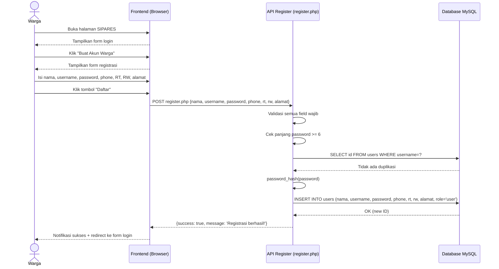
```mermaid
sequenceDiagram
    actor W as Warga
    participant FE as Frontend (Browser)
    participant API as API Register (register.php)
    participant DB as Database MySQL

    W->>FE: Buka halaman SIPARES
    FE-->>W: Tampilkan form login
    W->>FE: Klik "Buat Akun Warga"
    FE-->>W: Tampilkan form registrasi

    W->>FE: Isi nama, username, password, phone, RT, RW, alamat
    W->>FE: Klik tombol "Daftar"
    FE->>API: POST register.php {nama, username, password, phone, rt, rw, alamat}
    API->>API: Validasi semua field wajib
    API->>API: Cek panjang password >= 6
    API->>DB: SELECT id FROM users WHERE username=?
    DB-->>API: Tidak ada duplikasi

    API->>API: password_hash(password)
    API->>DB: INSERT INTO users (nama, username, password, phone, rt, rw, alamat, role='user')
    DB-->>API: OK (new ID)
    API-->>FE: {success: true, message: 'Registrasi berhasil!'}
    FE-->>W: Notifikasi sukses + redirect ke form login
```

#### B. Login Warga

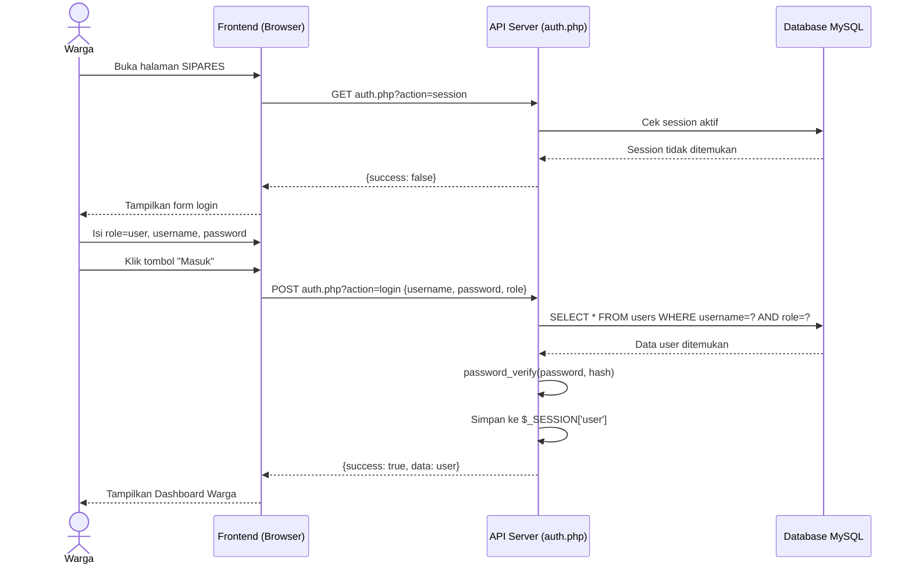
```mermaid
sequenceDiagram
    actor W as Warga
    participant FE as Frontend (Browser)
    participant API as API Server (auth.php)
    participant DB as Database MySQL

    W->>FE: Buka halaman SIPARES
    FE->>API: GET auth.php?action=session
    API->>DB: Cek session aktif
    DB-->>API: Session tidak ditemukan
    API-->>FE: {success: false}
    FE-->>W: Tampilkan form login

    W->>FE: Isi role=user, username, password
    W->>FE: Klik tombol "Masuk"
    FE->>API: POST auth.php?action=login {username, password, role}
    API->>DB: SELECT * FROM users WHERE username=? AND role=?
    DB-->>API: Data user ditemukan
    API->>API: password_verify(password, hash)
    API->>API: Simpan ke $_SESSION['user']
    API-->>FE: {success: true, data: user}
    FE-->>W: Tampilkan Dashboard Warga
```

#### C. Pembayaran Retribusi QRIS

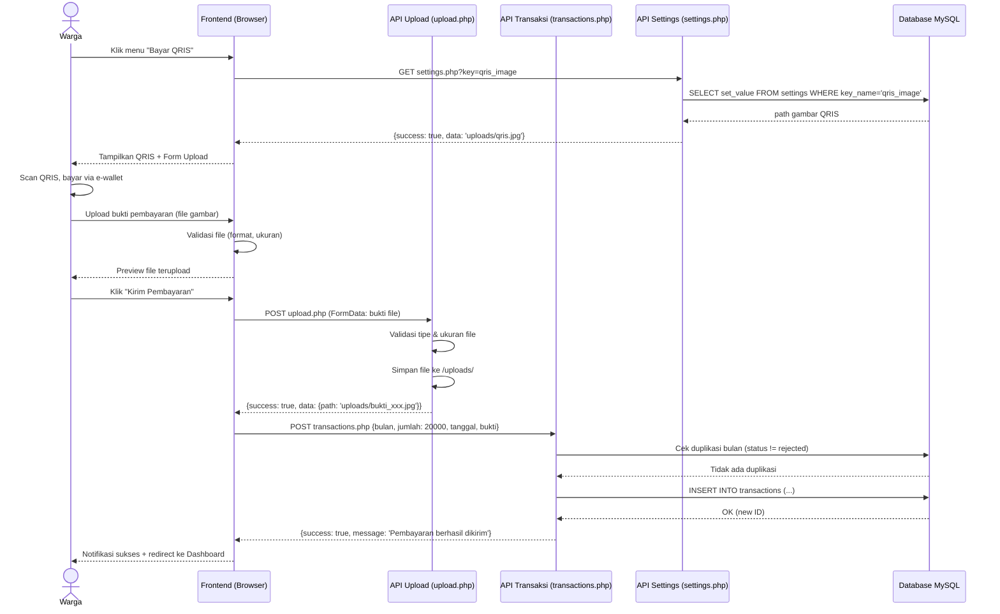
```mermaid
sequenceDiagram
    actor W as Warga
    participant FE as Frontend (Browser)
    participant UPLOAD as API Upload (upload.php)
    participant TRX as API Transaksi (transactions.php)
    participant SET as API Settings (settings.php)
    participant DB as Database MySQL

    W->>FE: Klik menu "Bayar QRIS"
    FE->>SET: GET settings.php?key=qris_image
    SET->>DB: SELECT set_value FROM settings WHERE key_name='qris_image'
    DB-->>SET: path gambar QRIS
    SET-->>FE: {success: true, data: 'uploads/qris.jpg'}
    FE-->>W: Tampilkan QRIS + Form Upload

    W->>W: Scan QRIS, bayar via e-wallet
    W->>FE: Upload bukti pembayaran (file gambar)
    FE->>FE: Validasi file (format, ukuran)
    FE-->>W: Preview file terupload

    W->>FE: Klik "Kirim Pembayaran"
    FE->>UPLOAD: POST upload.php (FormData: bukti file)
    UPLOAD->>UPLOAD: Validasi tipe & ukuran file
    UPLOAD->>UPLOAD: Simpan file ke /uploads/
    UPLOAD-->>FE: {success: true, data: {path: 'uploads/bukti_xxx.jpg'}}

    FE->>TRX: POST transactions.php {bulan, jumlah: 20000, tanggal, bukti}
    TRX->>DB: Cek duplikasi bulan (status != rejected)
    DB-->>TRX: Tidak ada duplikasi
    TRX->>DB: INSERT INTO transactions (...)
    DB-->>TRX: OK (new ID)
    TRX-->>FE: {success: true, message: 'Pembayaran berhasil dikirim'}
    FE-->>W: Notifikasi sukses + redirect ke Dashboard
```

#### D. Kirim Komplain

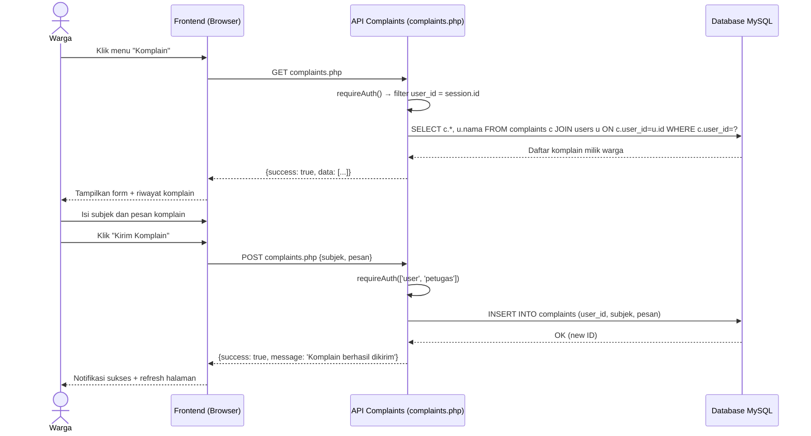
```mermaid
sequenceDiagram
    actor W as Warga
    participant FE as Frontend (Browser)
    participant API as API Complaints (complaints.php)
    participant DB as Database MySQL

    W->>FE: Klik menu "Komplain"
    FE->>API: GET complaints.php
    API->>API: requireAuth() → filter user_id = session.id
    API->>DB: SELECT c.*, u.nama FROM complaints c JOIN users u ON c.user_id=u.id WHERE c.user_id=?
    DB-->>API: Daftar komplain milik warga
    API-->>FE: {success: true, data: [...]}
    FE-->>W: Tampilkan form + riwayat komplain

    W->>FE: Isi subjek dan pesan komplain
    W->>FE: Klik "Kirim Komplain"
    FE->>API: POST complaints.php {subjek, pesan}
    API->>API: requireAuth(['user', 'petugas'])
    API->>DB: INSERT INTO complaints (user_id, subjek, pesan)
    DB-->>API: OK (new ID)
    API-->>FE: {success: true, message: 'Komplain berhasil dikirim'}
    FE-->>W: Notifikasi sukses + refresh halaman
```

#### E. Edit Profil Warga

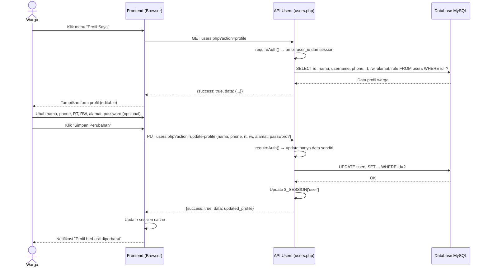
```mermaid
sequenceDiagram
    actor W as Warga
    participant FE as Frontend (Browser)
    participant API as API Users (users.php)
    participant DB as Database MySQL

    W->>FE: Klik menu "Profil Saya"
    FE->>API: GET users.php?action=profile
    API->>API: requireAuth() → ambil user_id dari session
    API->>DB: SELECT id, nama, username, phone, rt, rw, alamat, role FROM users WHERE id=?
    DB-->>API: Data profil warga
    API-->>FE: {success: true, data: {...}}
    FE-->>W: Tampilkan form profil (editable)

    W->>FE: Ubah nama, phone, RT, RW, alamat, password (opsional)
    W->>FE: Klik "Simpan Perubahan"
    FE->>API: PUT users.php?action=update-profile {nama, phone, rt, rw, alamat, password?}
    API->>API: requireAuth() → update hanya data sendiri
    API->>DB: UPDATE users SET ... WHERE id=?
    DB-->>API: OK
    API->>API: Update $_SESSION['user']
    API-->>FE: {success: true, data: updated_profile}
    FE->>FE: Update session cache
    FE-->>W: Notifikasi "Profil berhasil diperbarui"
```

---

### 2.2 Sequence Diagram — Petugas Kebersihan

#### A. Lihat Jadwal Pengambilan Sampah

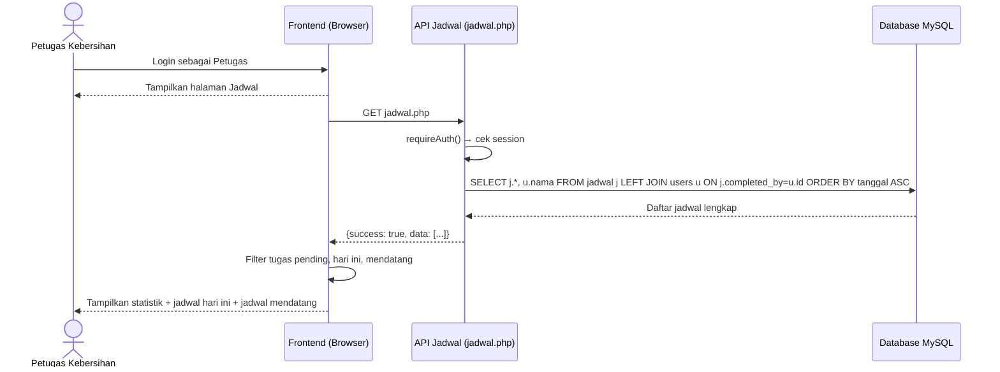
```mermaid
sequenceDiagram
    actor P as Petugas Kebersihan
    participant FE as Frontend (Browser)
    participant API as API Jadwal (jadwal.php)
    participant DB as Database MySQL

    P->>FE: Login sebagai Petugas
    FE-->>P: Tampilkan halaman Jadwal

    FE->>API: GET jadwal.php
    API->>API: requireAuth() → cek session
    API->>DB: SELECT j.*, u.nama FROM jadwal j LEFT JOIN users u ON j.completed_by=u.id ORDER BY tanggal ASC
    DB-->>API: Daftar jadwal lengkap
    API-->>FE: {success: true, data: [...]}
    FE->>FE: Filter tugas pending, hari ini, mendatang
    FE-->>P: Tampilkan statistik + jadwal hari ini + jadwal mendatang
```

#### B. Konfirmasi Penyelesaian Tugas (Submit Bukti)

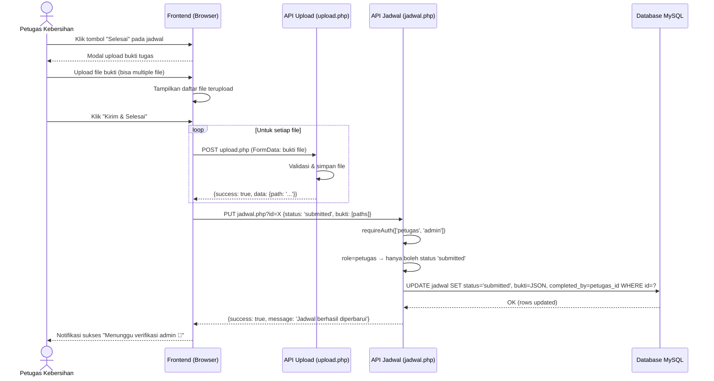
```mermaid
sequenceDiagram
    actor P as Petugas Kebersihan
    participant FE as Frontend (Browser)
    participant UPLOAD as API Upload (upload.php)
    participant API as API Jadwal (jadwal.php)
    participant DB as Database MySQL

    P->>FE: Klik tombol "Selesai" pada jadwal
    FE-->>P: Modal upload bukti tugas

    P->>FE: Upload file bukti (bisa multiple file)
    FE->>FE: Tampilkan daftar file terupload

    P->>FE: Klik "Kirim & Selesai"

    loop Untuk setiap file
        FE->>UPLOAD: POST upload.php (FormData: bukti file)
        UPLOAD->>UPLOAD: Validasi & simpan file
        UPLOAD-->>FE: {success: true, data: {path: '...'}}
    end

    FE->>API: PUT jadwal.php?id=X {status: 'submitted', bukti: [paths]}
    API->>API: requireAuth(['petugas', 'admin'])
    API->>API: role=petugas → hanya boleh status 'submitted'
    API->>DB: UPDATE jadwal SET status='submitted', bukti=JSON, completed_by=petugas_id WHERE id=?
    DB-->>API: OK (rows updated)
    API-->>FE: {success: true, message: 'Jadwal berhasil diperbarui'}
    FE-->>P: Notifikasi sukses "Menunggu verifikasi admin 🎉"
```

#### C. Kirim Komplain Petugas

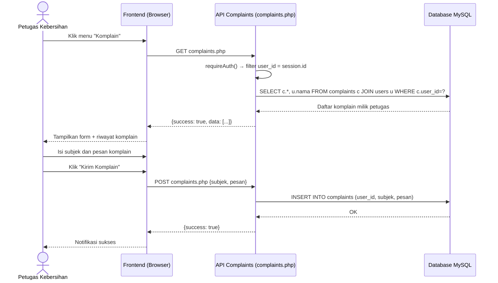
```mermaid
sequenceDiagram
    actor P as Petugas Kebersihan
    participant FE as Frontend (Browser)
    participant API as API Complaints (complaints.php)
    participant DB as Database MySQL

    P->>FE: Klik menu "Komplain"
    FE->>API: GET complaints.php
    API->>API: requireAuth() → filter user_id = session.id
    API->>DB: SELECT c.*, u.nama FROM complaints c JOIN users u WHERE c.user_id=?
    DB-->>API: Daftar komplain milik petugas
    API-->>FE: {success: true, data: [...]}
    FE-->>P: Tampilkan form + riwayat komplain

    P->>FE: Isi subjek dan pesan komplain
    P->>FE: Klik "Kirim Komplain"
    FE->>API: POST complaints.php {subjek, pesan}
    API->>DB: INSERT INTO complaints (user_id, subjek, pesan)
    DB-->>API: OK
    API-->>FE: {success: true}
    FE-->>P: Notifikasi sukses
```

#### D. Edit Profil Petugas

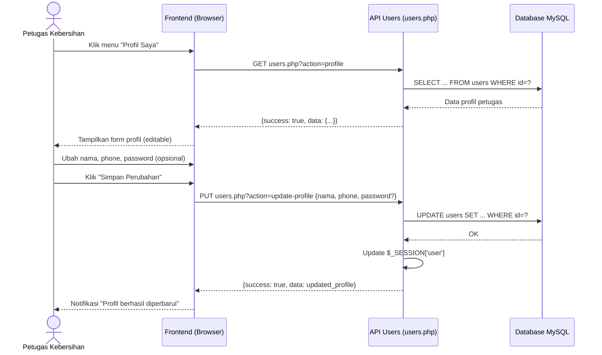
```mermaid
sequenceDiagram
    actor P as Petugas Kebersihan
    participant FE as Frontend (Browser)
    participant API as API Users (users.php)
    participant DB as Database MySQL

    P->>FE: Klik menu "Profil Saya"
    FE->>API: GET users.php?action=profile
    API->>DB: SELECT ... FROM users WHERE id=?
    DB-->>API: Data profil petugas
    API-->>FE: {success: true, data: {...}}
    FE-->>P: Tampilkan form profil (editable)

    P->>FE: Ubah nama, phone, password (opsional)
    P->>FE: Klik "Simpan Perubahan"
    FE->>API: PUT users.php?action=update-profile {nama, phone, password?}
    API->>DB: UPDATE users SET ... WHERE id=?
    DB-->>API: OK
    API->>API: Update $_SESSION['user']
    API-->>FE: {success: true, data: updated_profile}
    FE-->>P: Notifikasi "Profil berhasil diperbarui"
```

---

### 2.3 Sequence Diagram — Admin

#### A. Verifikasi Pembayaran Warga

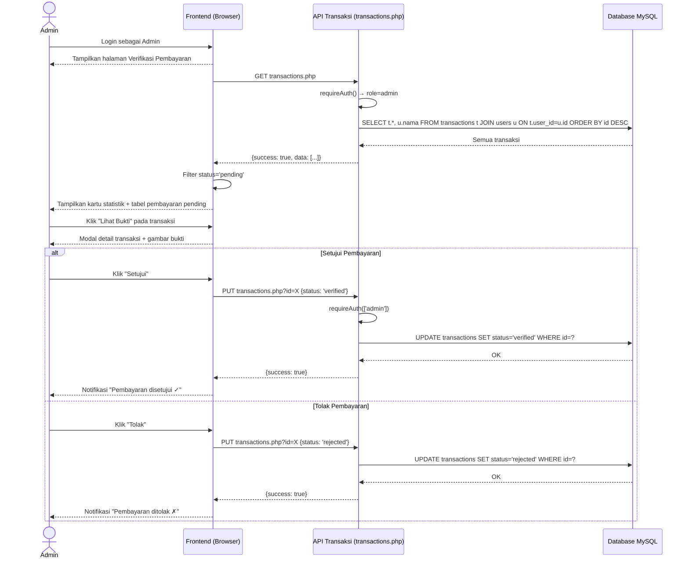
```mermaid
sequenceDiagram
    actor A as Admin
    participant FE as Frontend (Browser)
    participant API as API Transaksi (transactions.php)
    participant DB as Database MySQL

    A->>FE: Login sebagai Admin
    FE-->>A: Tampilkan halaman Verifikasi Pembayaran

    FE->>API: GET transactions.php
    API->>API: requireAuth() → role=admin
    API->>DB: SELECT t.*, u.nama FROM transactions t JOIN users u ON t.user_id=u.id ORDER BY id DESC
    DB-->>API: Semua transaksi
    API-->>FE: {success: true, data: [...]}
    FE->>FE: Filter status='pending'
    FE-->>A: Tampilkan kartu statistik + tabel pembayaran pending

    A->>FE: Klik "Lihat Bukti" pada transaksi
    FE-->>A: Modal detail transaksi + gambar bukti

    alt Setujui Pembayaran
        A->>FE: Klik "Setujui"
        FE->>API: PUT transactions.php?id=X {status: 'verified'}
        API->>API: requireAuth(['admin'])
        API->>DB: UPDATE transactions SET status='verified' WHERE id=?
        DB-->>API: OK
        API-->>FE: {success: true}
        FE-->>A: Notifikasi "Pembayaran disetujui ✓"
    else Tolak Pembayaran
        A->>FE: Klik "Tolak"
        FE->>API: PUT transactions.php?id=X {status: 'rejected'}
        API->>DB: UPDATE transactions SET status='rejected' WHERE id=?
        DB-->>API: OK
        API-->>FE: {success: true}
        FE-->>A: Notifikasi "Pembayaran ditolak ✗"
    end
```

#### B. Kelola Komplain Masuk

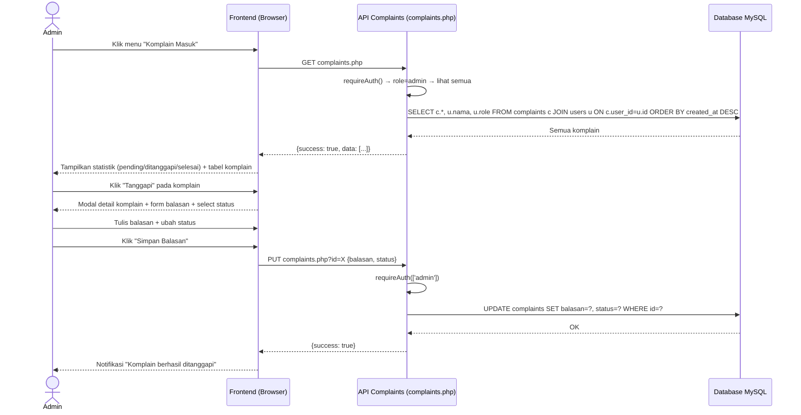
```mermaid
sequenceDiagram
    actor A as Admin
    participant FE as Frontend (Browser)
    participant API as API Complaints (complaints.php)
    participant DB as Database MySQL

    A->>FE: Klik menu "Komplain Masuk"
    FE->>API: GET complaints.php
    API->>API: requireAuth() → role=admin → lihat semua
    API->>DB: SELECT c.*, u.nama, u.role FROM complaints c JOIN users u ON c.user_id=u.id ORDER BY created_at DESC
    DB-->>API: Semua komplain
    API-->>FE: {success: true, data: [...]}
    FE-->>A: Tampilkan statistik (pending/ditanggapi/selesai) + tabel komplain

    A->>FE: Klik "Tanggapi" pada komplain
    FE-->>A: Modal detail komplain + form balasan + select status

    A->>FE: Tulis balasan + ubah status
    A->>FE: Klik "Simpan Balasan"
    FE->>API: PUT complaints.php?id=X {balasan, status}
    API->>API: requireAuth(['admin'])
    API->>DB: UPDATE complaints SET balasan=?, status=? WHERE id=?
    DB-->>API: OK
    API-->>FE: {success: true}
    FE-->>A: Notifikasi "Komplain berhasil ditanggapi"
```

#### C. Kelola Data Warga (CRUD)

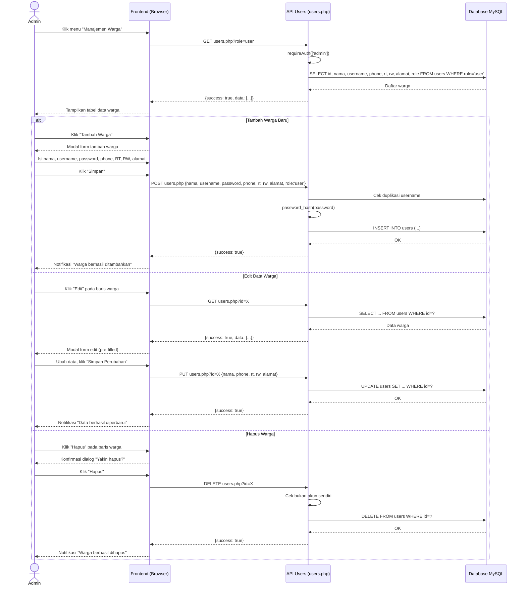
```mermaid
sequenceDiagram
    actor A as Admin
    participant FE as Frontend (Browser)
    participant API as API Users (users.php)
    participant DB as Database MySQL

    A->>FE: Klik menu "Manajemen Warga"
    FE->>API: GET users.php?role=user
    API->>API: requireAuth(['admin'])
    API->>DB: SELECT id, nama, username, phone, rt, rw, alamat, role FROM users WHERE role='user'
    DB-->>API: Daftar warga
    API-->>FE: {success: true, data: [...]}
    FE-->>A: Tampilkan tabel data warga

    alt Tambah Warga Baru
        A->>FE: Klik "Tambah Warga"
        FE-->>A: Modal form tambah warga
        A->>FE: Isi nama, username, password, phone, RT, RW, alamat
        A->>FE: Klik "Simpan"
        FE->>API: POST users.php {nama, username, password, phone, rt, rw, alamat, role:'user'}
        API->>DB: Cek duplikasi username
        API->>API: password_hash(password)
        API->>DB: INSERT INTO users (...)
        DB-->>API: OK
        API-->>FE: {success: true}
        FE-->>A: Notifikasi "Warga berhasil ditambahkan"
    else Edit Data Warga
        A->>FE: Klik "Edit" pada baris warga
        FE->>API: GET users.php?id=X
        API->>DB: SELECT ... FROM users WHERE id=?
        DB-->>API: Data warga
        API-->>FE: {success: true, data: {...}}
        FE-->>A: Modal form edit (pre-filled)
        A->>FE: Ubah data, klik "Simpan Perubahan"
        FE->>API: PUT users.php?id=X {nama, phone, rt, rw, alamat}
        API->>DB: UPDATE users SET ... WHERE id=?
        DB-->>API: OK
        API-->>FE: {success: true}
        FE-->>A: Notifikasi "Data berhasil diperbarui"
    else Hapus Warga
        A->>FE: Klik "Hapus" pada baris warga
        FE-->>A: Konfirmasi dialog "Yakin hapus?"
        A->>FE: Klik "Hapus"
        FE->>API: DELETE users.php?id=X
        API->>API: Cek bukan akun sendiri
        API->>DB: DELETE FROM users WHERE id=?
        DB-->>API: OK
        API-->>FE: {success: true}
        FE-->>A: Notifikasi "Warga berhasil dihapus"
    end
```

#### D. Kelola Jadwal & Validasi Tugas Petugas

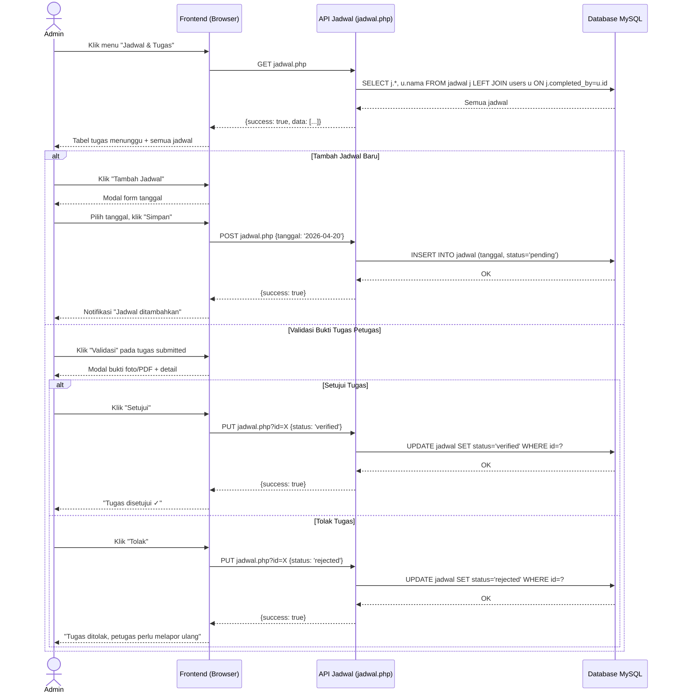
```mermaid
sequenceDiagram
    actor A as Admin
    participant FE as Frontend (Browser)
    participant API as API Jadwal (jadwal.php)
    participant DB as Database MySQL

    A->>FE: Klik menu "Jadwal & Tugas"
    FE->>API: GET jadwal.php
    API->>DB: SELECT j.*, u.nama FROM jadwal j LEFT JOIN users u ON j.completed_by=u.id
    DB-->>API: Semua jadwal
    API-->>FE: {success: true, data: [...]}
    FE-->>A: Tabel tugas menunggu + semua jadwal

    alt Tambah Jadwal Baru
        A->>FE: Klik "Tambah Jadwal"
        FE-->>A: Modal form tanggal
        A->>FE: Pilih tanggal, klik "Simpan"
        FE->>API: POST jadwal.php {tanggal: '2026-04-20'}
        API->>DB: INSERT INTO jadwal (tanggal, status='pending')
        DB-->>API: OK
        API-->>FE: {success: true}
        FE-->>A: Notifikasi "Jadwal ditambahkan"
    else Validasi Bukti Tugas Petugas
        A->>FE: Klik "Validasi" pada tugas submitted
        FE-->>A: Modal bukti foto/PDF + detail
        alt Setujui Tugas
            A->>FE: Klik "Setujui"
            FE->>API: PUT jadwal.php?id=X {status: 'verified'}
            API->>DB: UPDATE jadwal SET status='verified' WHERE id=?
            DB-->>API: OK
            API-->>FE: {success: true}
            FE-->>A: "Tugas disetujui ✓"
        else Tolak Tugas
            A->>FE: Klik "Tolak"
            FE->>API: PUT jadwal.php?id=X {status: 'rejected'}
            API->>DB: UPDATE jadwal SET status='rejected' WHERE id=?
            DB-->>API: OK
            API-->>FE: {success: true}
            FE-->>A: "Tugas ditolak, petugas perlu melapor ulang"
        end
    end
```

#### E. Pengaturan QRIS

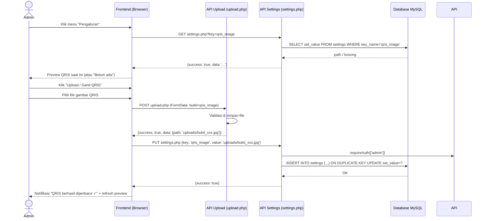
```mermaid
sequenceDiagram
    actor A as Admin
    participant FE as Frontend (Browser)
    participant UPLOAD as API Upload (upload.php)
    participant SET as API Settings (settings.php)
    participant DB as Database MySQL

    A->>FE: Klik menu "Pengaturan"
    FE->>SET: GET settings.php?key=qris_image
    SET->>DB: SELECT set_value FROM settings WHERE key_name='qris_image'
    DB-->>SET: path / kosong
    SET-->>FE: {success: true, data: '...'}
    FE-->>A: Preview QRIS saat ini (atau "Belum ada")

    A->>FE: Klik "Upload / Ganti QRIS"
    A->>FE: Pilih file gambar QRIS
    FE->>UPLOAD: POST upload.php (FormData: bukti=qris_image)
    UPLOAD->>UPLOAD: Validasi & simpan file
    UPLOAD-->>FE: {success: true, data: {path: 'uploads/bukti_xxx.jpg'}}

    FE->>SET: PUT settings.php {key: 'qris_image', value: 'uploads/bukti_xxx.jpg'}
    SET->>API: requireAuth(['admin'])
    SET->>DB: INSERT INTO settings (...) ON DUPLICATE KEY UPDATE set_value=?
    DB-->>SET: OK
    SET-->>FE: {success: true}
    FE-->>A: Notifikasi "QRIS berhasil diperbarui ✓" + refresh preview
```

---

## 3. 🏗️ Class Diagram

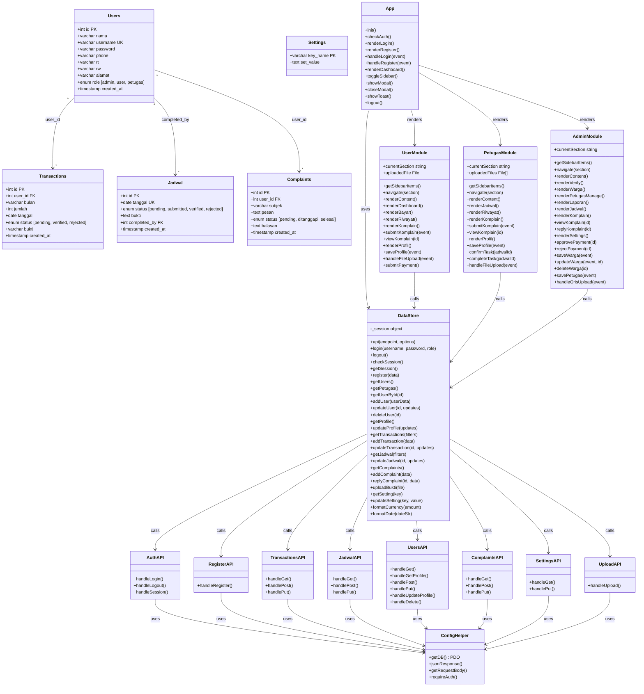
```mermaid
classDiagram
    class Users {
        +int id PK
        +varchar nama
        +varchar username UK
        +varchar password
        +varchar phone
        +varchar rt
        +varchar rw
        +varchar alamat
        +enum role [admin, user, petugas]
        +timestamp created_at
    }

    class Transactions {
        +int id PK
        +int user_id FK
        +varchar bulan
        +int jumlah
        +date tanggal
        +enum status [pending, verified, rejected]
        +varchar bukti
        +timestamp created_at
    }

    class Jadwal {
        +int id PK
        +date tanggal UK
        +enum status [pending, submitted, verified, rejected]
        +text bukti
        +int completed_by FK
        +timestamp created_at
    }

    class Complaints {
        +int id PK
        +int user_id FK
        +varchar subjek
        +text pesan
        +enum status [pending, ditanggapi, selesai]
        +text balasan
        +timestamp created_at
    }

    class Settings {
        +varchar key_name PK
        +text set_value
    }

    class AuthAPI {
        +handleLogin()
        +handleLogout()
        +handleSession()
    }

    class RegisterAPI {
        +handleRegister()
    }

    class TransactionsAPI {
        +handleGet()
        +handlePost()
        +handlePut()
    }

    class JadwalAPI {
        +handleGet()
        +handlePost()
        +handlePut()
    }

    class UsersAPI {
        +handleGet()
        +handleGetProfile()
        +handlePost()
        +handlePut()
        +handleUpdateProfile()
        +handleDelete()
    }

    class ComplaintsAPI {
        +handleGet()
        +handlePost()
        +handlePut()
    }

    class SettingsAPI {
        +handleGet()
        +handlePut()
    }

    class UploadAPI {
        +handleUpload()
    }

    class ConfigHelper {
        +getDB() PDO
        +jsonResponse()
        +getRequestBody()
        +requireAuth()
    }

    class DataStore {
        -_session object
        +api(endpoint, options)
        +login(username, password, role)
        +logout()
        +checkSession()
        +getSession()
        +register(data)
        +getUsers()
        +getPetugas()
        +getUserById(id)
        +addUser(userData)
        +updateUser(id, updates)
        +deleteUser(id)
        +getProfile()
        +updateProfile(updates)
        +getTransactions(filters)
        +addTransaction(data)
        +updateTransaction(id, updates)
        +getJadwal(filters)
        +updateJadwal(id, updates)
        +getComplaints()
        +addComplaint(data)
        +replyComplaint(id, data)
        +uploadBukti(file)
        +getSetting(key)
        +updateSetting(key, value)
        +formatCurrency(amount)
        +formatDate(dateStr)
    }

    class App {
        +init()
        +checkAuth()
        +renderLogin()
        +renderRegister()
        +handleLogin(event)
        +handleRegister(event)
        +renderDashboard()
        +toggleSidebar()
        +showModal()
        +closeModal()
        +showToast()
        +logout()
    }

    class UserModule {
        +currentSection string
        +uploadedFile File
        +getSidebarItems()
        +navigate(section)
        +renderContent()
        +renderDashboard()
        +renderBayar()
        +renderRiwayat()
        +renderKomplain()
        +submitKomplain(event)
        +viewKomplain(id)
        +renderProfil()
        +saveProfile(event)
        +handleFileUpload(event)
        +submitPayment()
    }

    class PetugasModule {
        +currentSection string
        +uploadedFiles File[]
        +getSidebarItems()
        +navigate(section)
        +renderContent()
        +renderJadwal()
        +renderRiwayat()
        +renderKomplain()
        +submitKomplain(event)
        +viewKomplain(id)
        +renderProfil()
        +saveProfile(event)
        +confirmTask(jadwalId)
        +completeTask(jadwalId)
        +handleFileUpload(event)
    }

    class AdminModule {
        +currentSection string
        +getSidebarItems()
        +navigate(section)
        +renderContent()
        +renderVerify()
        +renderWarga()
        +renderPetugasManage()
        +renderLaporan()
        +renderJadwal()
        +renderKomplain()
        +viewKomplain(id)
        +replyKomplain(id)
        +renderSettings()
        +approvePayment(id)
        +rejectPayment(id)
        +saveWarga(event)
        +updateWarga(event, id)
        +deleteWarga(id)
        +savePetugas(event)
        +handleQrisUpload(event)
    }

    Users "1" --> "*" Transactions : user_id
    Users "1" --> "*" Jadwal : completed_by
    Users "1" --> "*" Complaints : user_id
    
    AuthAPI --> ConfigHelper : uses
    RegisterAPI --> ConfigHelper : uses
    TransactionsAPI --> ConfigHelper : uses
    JadwalAPI --> ConfigHelper : uses
    UsersAPI --> ConfigHelper : uses
    ComplaintsAPI --> ConfigHelper : uses
    SettingsAPI --> ConfigHelper : uses
    UploadAPI --> ConfigHelper : uses

    DataStore --> AuthAPI : calls
    DataStore --> RegisterAPI : calls
    DataStore --> TransactionsAPI : calls
    DataStore --> JadwalAPI : calls
    DataStore --> UsersAPI : calls
    DataStore --> ComplaintsAPI : calls
    DataStore --> SettingsAPI : calls
    DataStore --> UploadAPI : calls

    App --> DataStore : uses
    App --> UserModule : renders
    App --> PetugasModule : renders
    App --> AdminModule : renders

    UserModule --> DataStore : calls
    PetugasModule --> DataStore : calls
    AdminModule --> DataStore : calls
```

---

## 4. 🚶 Activity Diagram

### 4.1 Activity Diagram — Warga (Pembayaran, Komplain, Profil)

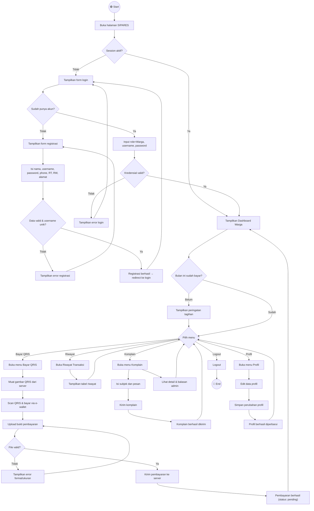
```mermaid
flowchart TD
    START(("🟢 Start"))
    OPEN["Buka halaman SIPARES"]
    CHECK_SESSION{"Session aktif?"}
    SHOW_LOGIN["Tampilkan form login"]
    HAS_ACCOUNT{"Sudah punya akun?"}
    
    REGISTER["Tampilkan form registrasi"]
    INPUT_REG["Isi nama, username, password, phone, RT, RW, alamat"]
    VALIDATE_REG{"Data valid & username unik?"}
    REG_FAIL["Tampilkan error registrasi"]
    REG_SUCCESS["Registrasi berhasil → redirect ke login"]

    INPUT_CRED["Input role=Warga, username, password"]
    VALIDATE_LOGIN{"Kredensial valid?"}
    LOGIN_FAIL["Tampilkan error login"]
    DASHBOARD["Tampilkan Dashboard Warga"]
    CHECK_MONTH{"Bulan ini sudah bayar?"}
    SHOW_WARNING["Tampilkan peringatan tagihan"]
    CHOOSE_MENU{"Pilih menu"}

    BAYAR["Buka menu Bayar QRIS"]
    LOAD_QRIS["Muat gambar QRIS dari server"]
    SCAN_QRIS["Scan QRIS & bayar via e-wallet"]
    UPLOAD_BUKTI["Upload bukti pembayaran"]
    VALIDATE_FILE{"File valid?"}
    FILE_INVALID["Tampilkan error format/ukuran"]
    SUBMIT_PAYMENT["Kirim pembayaran ke server"]
    PAYMENT_SUCCESS["Pembayaran berhasil (status: pending)"]

    RIWAYAT["Buka Riwayat Transaksi"]
    SHOW_TRX["Tampilkan tabel riwayat"]

    KOMPLAIN["Buka menu Komplain"]
    INPUT_KOMPLAIN["Isi subjek dan pesan"]
    SUBMIT_KOMPLAIN["Kirim komplain"]
    KOMPLAIN_SUCCESS["Komplain berhasil dikirim"]
    VIEW_KOMPLAIN["Lihat detail & balasan admin"]

    PROFIL["Buka menu Profil"]
    EDIT_PROFIL["Edit data profil"]
    SAVE_PROFIL["Simpan perubahan profil"]
    PROFIL_SUCCESS["Profil berhasil diperbarui"]

    LOGOUT["Logout"]
    STOP(("🔴 End"))

    START --> OPEN
    OPEN --> CHECK_SESSION
    CHECK_SESSION -->|Ya| DASHBOARD
    CHECK_SESSION -->|Tidak| SHOW_LOGIN
    SHOW_LOGIN --> HAS_ACCOUNT
    HAS_ACCOUNT -->|Ya| INPUT_CRED
    HAS_ACCOUNT -->|Tidak| REGISTER

    REGISTER --> INPUT_REG
    INPUT_REG --> VALIDATE_REG
    VALIDATE_REG -->|Tidak| REG_FAIL
    REG_FAIL --> REGISTER
    VALIDATE_REG -->|Ya| REG_SUCCESS
    REG_SUCCESS --> SHOW_LOGIN

    INPUT_CRED --> VALIDATE_LOGIN
    VALIDATE_LOGIN -->|Tidak| LOGIN_FAIL
    LOGIN_FAIL --> SHOW_LOGIN
    VALIDATE_LOGIN -->|Ya| DASHBOARD

    DASHBOARD --> CHECK_MONTH
    CHECK_MONTH -->|Belum| SHOW_WARNING
    SHOW_WARNING --> CHOOSE_MENU
    CHECK_MONTH -->|Sudah| CHOOSE_MENU

    CHOOSE_MENU -->|Bayar QRIS| BAYAR
    CHOOSE_MENU -->|Riwayat| RIWAYAT
    CHOOSE_MENU -->|Komplain| KOMPLAIN
    CHOOSE_MENU -->|Profil| PROFIL
    CHOOSE_MENU -->|Logout| LOGOUT

    BAYAR --> LOAD_QRIS --> SCAN_QRIS --> UPLOAD_BUKTI --> VALIDATE_FILE
    VALIDATE_FILE -->|Tidak| FILE_INVALID --> UPLOAD_BUKTI
    VALIDATE_FILE -->|Ya| SUBMIT_PAYMENT --> PAYMENT_SUCCESS --> DASHBOARD

    RIWAYAT --> SHOW_TRX --> CHOOSE_MENU

    KOMPLAIN --> INPUT_KOMPLAIN --> SUBMIT_KOMPLAIN --> KOMPLAIN_SUCCESS --> CHOOSE_MENU
    KOMPLAIN --> VIEW_KOMPLAIN --> CHOOSE_MENU

    PROFIL --> EDIT_PROFIL --> SAVE_PROFIL --> PROFIL_SUCCESS --> CHOOSE_MENU

    LOGOUT --> STOP
```

---

### 4.2 Activity Diagram — Petugas Kebersihan

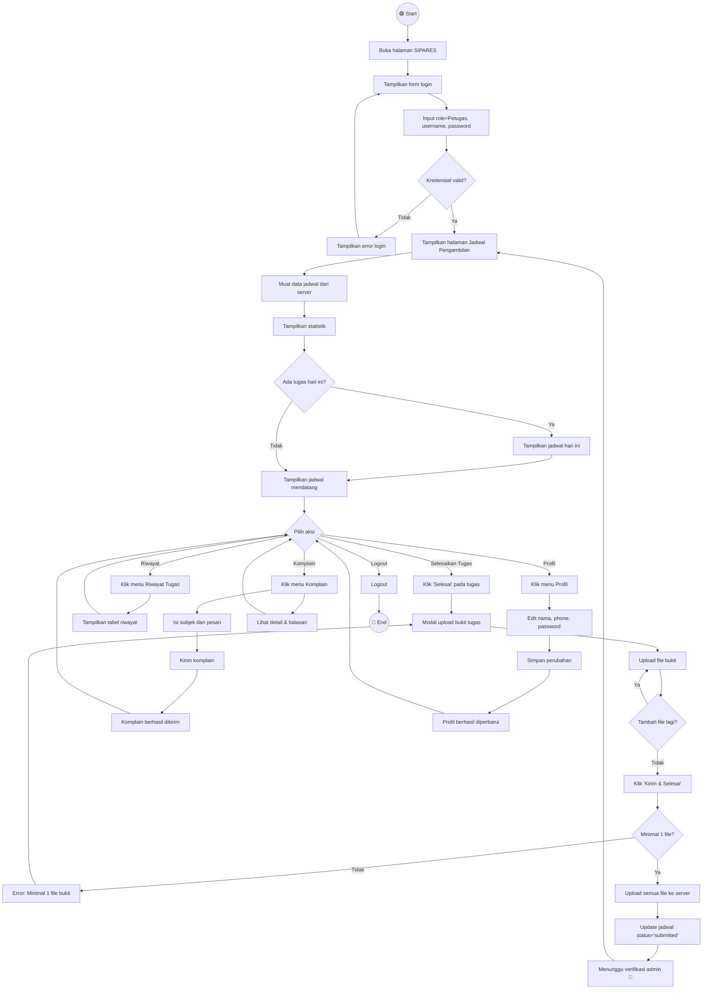
```mermaid
flowchart TD
    START(("🟢 Start"))
    LOGIN["Buka halaman SIPARES"]
    SHOW_LOGIN["Tampilkan form login"]
    INPUT_CRED["Input role=Petugas, username, password"]
    VALIDATE_LOGIN{"Kredensial valid?"}
    LOGIN_FAIL["Tampilkan error login"]
    DASHBOARD["Tampilkan halaman Jadwal Pengambilan"]
    LOAD_JADWAL["Muat data jadwal dari server"]
    SHOW_STATS["Tampilkan statistik"]
    CHECK_TODAY{"Ada tugas hari ini?"}
    SHOW_TODAY["Tampilkan jadwal hari ini"]
    SHOW_UPCOMING["Tampilkan jadwal mendatang"]

    CHOOSE{"Pilih aksi"}

    KLIK_SELESAI["Klik 'Selesai' pada tugas"]
    MODAL_UPLOAD["Modal upload bukti tugas"]
    UPLOAD_FILES["Upload file bukti"]
    ADD_MORE{"Tambah file lagi?"}
    SUBMIT_TASK["Klik 'Kirim & Selesai'"]
    CHECK_FILES{"Minimal 1 file?"}
    FILE_ERROR["Error: Minimal 1 file bukti"]
    UPLOAD_LOOP["Upload semua file ke server"]
    UPDATE_STATUS["Update jadwal status='submitted'"]
    TASK_SUCCESS["Menunggu verifikasi admin 🎉"]

    RIWAYAT["Klik menu Riwayat Tugas"]
    SHOW_HISTORY["Tampilkan tabel riwayat"]

    KOMPLAIN["Klik menu Komplain"]
    INPUT_KOMPLAIN["Isi subjek dan pesan"]
    SUBMIT_KOMPLAIN["Kirim komplain"]
    KOMPLAIN_SUCCESS["Komplain berhasil dikirim"]
    VIEW_KOMPLAIN["Lihat detail & balasan"]

    PROFIL["Klik menu Profil"]
    EDIT_PROFIL["Edit nama, phone, password"]
    SAVE_PROFIL["Simpan perubahan"]
    PROFIL_SUCCESS["Profil berhasil diperbarui"]

    LOGOUT["Logout"]
    STOP(("🔴 End"))

    START --> LOGIN --> SHOW_LOGIN --> INPUT_CRED --> VALIDATE_LOGIN
    VALIDATE_LOGIN -->|Tidak| LOGIN_FAIL --> SHOW_LOGIN
    VALIDATE_LOGIN -->|Ya| DASHBOARD

    DASHBOARD --> LOAD_JADWAL --> SHOW_STATS --> CHECK_TODAY
    CHECK_TODAY -->|Ya| SHOW_TODAY --> SHOW_UPCOMING --> CHOOSE
    CHECK_TODAY -->|Tidak| SHOW_UPCOMING

    CHOOSE -->|Selesaikan Tugas| KLIK_SELESAI
    CHOOSE -->|Riwayat| RIWAYAT
    CHOOSE -->|Komplain| KOMPLAIN
    CHOOSE -->|Profil| PROFIL
    CHOOSE -->|Logout| LOGOUT

    KLIK_SELESAI --> MODAL_UPLOAD --> UPLOAD_FILES --> ADD_MORE
    ADD_MORE -->|Ya| UPLOAD_FILES
    ADD_MORE -->|Tidak| SUBMIT_TASK --> CHECK_FILES
    CHECK_FILES -->|Tidak| FILE_ERROR --> MODAL_UPLOAD
    CHECK_FILES -->|Ya| UPLOAD_LOOP --> UPDATE_STATUS --> TASK_SUCCESS --> DASHBOARD

    RIWAYAT --> SHOW_HISTORY --> CHOOSE

    KOMPLAIN --> INPUT_KOMPLAIN --> SUBMIT_KOMPLAIN --> KOMPLAIN_SUCCESS --> CHOOSE
    KOMPLAIN --> VIEW_KOMPLAIN --> CHOOSE

    PROFIL --> EDIT_PROFIL --> SAVE_PROFIL --> PROFIL_SUCCESS --> CHOOSE

    LOGOUT --> STOP
```

---

### 4.3 Activity Diagram — Admin

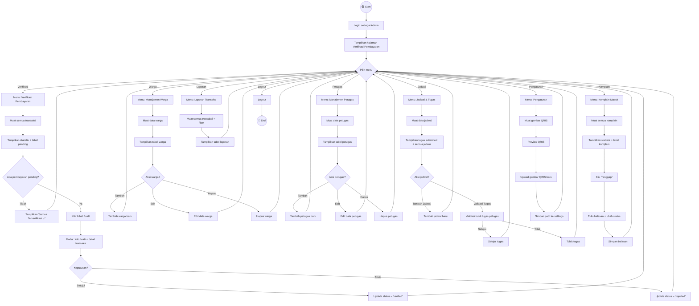
```mermaid
flowchart TD
    START(("🟢 Start"))
    LOGIN["Login sebagai Admin"]
    DASHBOARD["Tampilkan halaman Verifikasi Pembayaran"]
    CHOOSE{"Pilih menu"}

    %% Verifikasi Pembayaran
    VERIFY["Menu: Verifikasi Pembayaran"]
    LOAD_TRX["Muat semua transaksi"]
    SHOW_PENDING["Tampilkan statistik + tabel pending"]
    HAS_PENDING{"Ada pembayaran pending?"}
    NO_PENDING["Tampilkan 'Semua Terverifikasi ✅'"]
    VIEW_PROOF["Klik 'Lihat Bukti'"]
    SHOW_PROOF["Modal: foto bukti + detail transaksi"]
    VERIFY_DECISION{"Keputusan?"}
    APPROVE_PAY["Update status = 'verified'"]
    REJECT_PAY["Update status = 'rejected'"]

    %% Manajemen Warga
    WARGA["Menu: Manajemen Warga"]
    LOAD_WARGA["Muat data warga"]
    SHOW_WARGA["Tampilkan tabel warga"]
    WARGA_ACTION{"Aksi warga?"}
    ADD_WARGA["Tambah warga baru"]
    EDIT_WARGA["Edit data warga"]
    DELETE_WARGA["Hapus warga"]

    %% Manajemen Petugas
    PETUGAS["Menu: Manajemen Petugas"]
    LOAD_PETUGAS["Muat data petugas"]
    SHOW_PETUGAS["Tampilkan tabel petugas"]
    PETUGAS_ACTION{"Aksi petugas?"}
    ADD_PETUGAS["Tambah petugas baru"]
    EDIT_PETUGAS["Edit data petugas"]
    DELETE_PETUGAS["Hapus petugas"]

    %% Jadwal
    JADWAL["Menu: Jadwal & Tugas"]
    LOAD_JADWAL["Muat data jadwal"]
    SHOW_JADWAL["Tampilkan tugas submitted + semua jadwal"]
    JADWAL_ACTION{"Aksi jadwal?"}
    ADD_JADWAL["Tambah jadwal baru"]
    VALIDATE_TASK["Validasi bukti tugas petugas"]
    APPROVE_TASK["Setujui tugas"]
    REJECT_TASK["Tolak tugas"]

    %% Laporan
    LAPORAN["Menu: Laporan Transaksi"]
    LOAD_LAPORAN["Muat semua transaksi + filter"]
    SHOW_LAPORAN["Tampilkan tabel laporan"]

    %% Komplain
    KOMPLAIN_MENU["Menu: Komplain Masuk"]
    LOAD_KOMPLAIN["Muat semua komplain"]
    SHOW_KOMPLAIN["Tampilkan statistik + tabel komplain"]
    VIEW_KOMPLAIN["Klik 'Tanggapi'"]
    REPLY_KOMPLAIN["Tulis balasan + ubah status"]
    SAVE_REPLY["Simpan balasan"]

    %% Settings
    SETTINGS["Menu: Pengaturan"]
    LOAD_QRIS["Muat gambar QRIS"]
    SHOW_QRIS["Preview QRIS"]
    UPLOAD_QRIS["Upload gambar QRIS baru"]
    SAVE_QRIS["Simpan path ke settings"]

    LOGOUT["Logout"]
    STOP(("🔴 End"))

    START --> LOGIN --> DASHBOARD --> CHOOSE

    CHOOSE -->|Verifikasi| VERIFY
    CHOOSE -->|Warga| WARGA
    CHOOSE -->|Petugas| PETUGAS
    CHOOSE -->|Jadwal| JADWAL
    CHOOSE -->|Laporan| LAPORAN
    CHOOSE -->|Komplain| KOMPLAIN_MENU
    CHOOSE -->|Pengaturan| SETTINGS
    CHOOSE -->|Logout| LOGOUT

    VERIFY --> LOAD_TRX --> SHOW_PENDING --> HAS_PENDING
    HAS_PENDING -->|Tidak| NO_PENDING --> CHOOSE
    HAS_PENDING -->|Ya| VIEW_PROOF --> SHOW_PROOF --> VERIFY_DECISION
    VERIFY_DECISION -->|Setujui| APPROVE_PAY --> CHOOSE
    VERIFY_DECISION -->|Tolak| REJECT_PAY --> CHOOSE

    WARGA --> LOAD_WARGA --> SHOW_WARGA --> WARGA_ACTION
    WARGA_ACTION -->|Tambah| ADD_WARGA --> CHOOSE
    WARGA_ACTION -->|Edit| EDIT_WARGA --> CHOOSE
    WARGA_ACTION -->|Hapus| DELETE_WARGA --> CHOOSE

    PETUGAS --> LOAD_PETUGAS --> SHOW_PETUGAS --> PETUGAS_ACTION
    PETUGAS_ACTION -->|Tambah| ADD_PETUGAS --> CHOOSE
    PETUGAS_ACTION -->|Edit| EDIT_PETUGAS --> CHOOSE
    PETUGAS_ACTION -->|Hapus| DELETE_PETUGAS --> CHOOSE

    JADWAL --> LOAD_JADWAL --> SHOW_JADWAL --> JADWAL_ACTION
    JADWAL_ACTION -->|Tambah Jadwal| ADD_JADWAL --> CHOOSE
    JADWAL_ACTION -->|Validasi Tugas| VALIDATE_TASK
    VALIDATE_TASK -->|Setujui| APPROVE_TASK --> CHOOSE
    VALIDATE_TASK -->|Tolak| REJECT_TASK --> CHOOSE

    LAPORAN --> LOAD_LAPORAN --> SHOW_LAPORAN --> CHOOSE

    KOMPLAIN_MENU --> LOAD_KOMPLAIN --> SHOW_KOMPLAIN --> VIEW_KOMPLAIN
    VIEW_KOMPLAIN --> REPLY_KOMPLAIN --> SAVE_REPLY --> CHOOSE

    SETTINGS --> LOAD_QRIS --> SHOW_QRIS --> UPLOAD_QRIS --> SAVE_QRIS --> CHOOSE

    LOGOUT --> STOP
```

---

## 📝 Ringkasan Sistem

| Komponen | Teknologi |
|----------|-----------|
| **Frontend** | HTML5 + CSS3 + JavaScript (SPA) |
| **Backend** | PHP 7+ (REST API) |
| **Database** | MySQL (via PDO) |
| **Authentication** | PHP Session + password_hash/password_verify |
| **File Upload** | PHP native (multipart/form-data) |
| **Pembayaran** | QRIS (gambar dinamis dari admin) |

| Aktor | Fitur Utama |
|-------|-------------|
| **Warga** | Registrasi Akun, Dashboard, Bayar QRIS, Upload Bukti, Riwayat Transaksi, Komplain, Edit Profil |
| **Petugas Kebersihan** | Jadwal Pengambilan, Konfirmasi Tugas + Upload Bukti, Riwayat Tugas, Komplain, Edit Profil |
| **Admin** | Verifikasi Pembayaran, CRUD Warga, CRUD Petugas, Kelola Jadwal, Validasi Tugas, Laporan, Kelola Komplain, Pengaturan QRIS |
